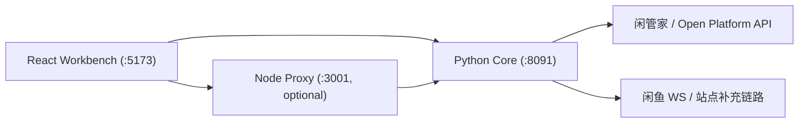

# xianyu-openclaw

闲鱼自动化工作台，当前主线采用 API-first 架构：

- `Python` 是核心业务引擎，负责商品、订单、消息、自动上架、配置和诊断。
- `React` 是运营工作台，所有页面都接真实接口，不使用 mock 数据。
- `Node` 是可选薄代理，只负责 webhook 验签和少量转发，不承载核心业务。
- `OpenClaw` 不再是运行前提；只有 API 做不到的链路，才保留 WS 或站点侧补充能力。

## 当前能力

- 工作台总览：真实读取系统状态、Cookie 健康、消息统计、订单统计、近期操作。
- 商品管理：查询商品列表、上架、下架、查看详情跳转。
- 自动上架：AI 文案生成、模板图生成、本地预览、OSS 上传、闲管家创建商品。
- 订单中心：查询订单、改价、发货。
- 消息中心：读取真实消息统计和 `presales` 运行日志。
- 店铺管理：读取账号健康状态、更新 Cookie、启停自动化模块。
- 配置中心：统一通过 Python 配置接口读写 AI / 闲管家 / 自动化配置。

## 架构



关键原则：

- 商品、订单、配置、自动上架优先走闲管家 / Open Platform API。
- 消息等无法纯 API 覆盖的链路，保留 Python 侧 WS / 站点补充实现。
- Node 不是业务真相源；配置和业务状态以 Python 为准。

## 快速开始

1. 复制环境变量模板：

```bash
cp .env.example .env
```

2. 至少填写这些配置：

```env
XIANYU_COOKIE_1=
AI_PROVIDER=deepseek
AI_API_KEY=
AI_BASE_URL=https://api.deepseek.com/v1
AI_MODEL=deepseek-chat
XGJ_APP_KEY=
XGJ_APP_SECRET=
XGJ_BASE_URL=https://open.goofish.pro
```

3. 本地启动：

```bash
./start.sh
```

默认地址：

- 前端工作台：`http://localhost:5173`
- Python 核心：`http://localhost:8091`
- Node 薄代理：`http://localhost:3001`

也可以分别启动：

```bash
python3 -m venv .venv
source .venv/bin/activate
pip install -r requirements.txt
python3 -m src.dashboard_server --port 8091

cd server && npm install && npm run dev
cd client && npm install && npm run dev
```

## Docker

容器化部署使用：

```bash
docker compose up -d --build
docker compose ps
```

Compose 会启动：

- `python-backend`
- `node-backend`
- `react-frontend`

## 文档索引

- [QUICKSTART.md](QUICKSTART.md)
- [USER_GUIDE.md](USER_GUIDE.md)
- [docs/API.md](docs/API.md)
- [docs/DEPLOYMENT.md](docs/DEPLOYMENT.md)
- [docs/PROJECT_PLAN.md](docs/PROJECT_PLAN.md)

## 当前取舍

- 保留仓库名 `xianyu-openclaw`，但运行架构已经切到“不依赖 OpenClaw”。
- 旧 `client/server` 的 code-review SaaS 遗留已经从主路径移除。
- 历史审计、评审和证据文档会保留原始内容；以本 README 和上述主文档为当前口径。
