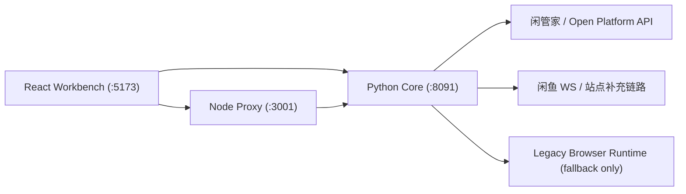

# xianyu-openclaw

闲鱼自动化工作台，当前主线已经切到 API-first 架构：

- `Python` 是唯一核心业务引擎，负责配置、账号、商品、订单、消息、自动上架和诊断。
- `React` 是运营工作台，页面全部接真实接口，不提供演示型 mock 数据。
- `Node` 是推荐随工作台一起运行的薄代理，负责 webhook 验签、闲管家透传和少量健康检查。
- `Legacy Browser Runtime` 只保留给 API 暂时覆盖不了的链路，不再是默认依赖。

## 项目规模

| 语言 / 类型 | 文件数 | 代码行数 |
|---|---|---|
| Python（业务源码 `src/`）| 约 110 | 约 36,600 |
| Python（测试 `tests/`）| 约 146 | 约 25,100 |
| Python（其他）| 约 10 | 约 1,000 |
| JavaScript（React 前端 `client/`）| 约 30 | 约 2,200 |
| JavaScript（Node 代理 `server/`）| 约 5 | 约 330 |
| Shell / 批处理脚本 | 约 20 | 约 2,900 |
| 配置 / YAML / TOML | — | 约 800 |
| **合计** | **约 320+** | **约 68,900** |

> 统计口径：排除 `.git`、`node_modules`、二进制文件及 lockfile，以 `wc -l` 为准；其中纯 Python 合计约 62,700 行。

## 当前能力

- 工作台：真实显示系统状态、Cookie 健康、近期操作和核心摘要。
- 商品管理：读取闲管家商品、上架、下架、跳转详情。
- 自动上架：AI 文案生成、模板图生成、本地预览、OSS 上传、闲管家创建商品。
- 订单中心：读取订单、改价、发货、查看回调配置。
- 消息中心：显示真实消息状态和 `presales` 日志，不再提供本地伪发送。
- 店铺管理：查看账号健康、更新 Cookie、启停自动化模块。
- 系统配置：统一通过 Python 配置接口维护 AI、闲管家和自动化配置。
- 运维诊断：保留 Python Dashboard API、日志查看、模块检查和服务控制能力。

## 服务关系



关键原则：

- 商品、订单、配置、自动上架优先走闲管家 / Open Platform API。
- 消息等 API 无法完整覆盖的能力，保留 Python 侧 WS 或站点补充链路。
- Node 不是业务真相源；配置和运行状态以 Python 为准。

## 快速开始

1. 复制配置模板：

```bash
cp .env.example .env
```

2. 至少填写这些配置：

```env
XIANYU_COOKIE_1=
AI_PROVIDER=deepseek
AI_API_KEY=
AI_BASE_URL=https://api.deepseek.com/v1
AI_MODEL=deepseek-chat
XGJ_APP_KEY=
XGJ_APP_SECRET=
XGJ_BASE_URL=https://open.goofish.pro
```

3. 启动服务：

```bash
./start.sh
```

Windows：

```bat
start.bat
```

默认地址：

- 前端工作台：`http://localhost:5173`
- Python 核心：`http://localhost:8091`
- Node 薄代理：`http://localhost:3001`

## Docker

```bash
docker compose up -d --build
docker compose ps
```

Compose 默认启动：

- `react-frontend`
- `python-backend`
- `node-backend`

## 文档索引

- [快速开始](QUICKSTART.md)
- [用户指南](USER_GUIDE.md)
- [API 文档](docs/API.md)
- [部署说明](docs/DEPLOYMENT.md)
- [项目计划](docs/PROJECT_PLAN.md)
- [发布结论](docs/qa-release-verdict.md)
- [发布说明](docs/release/2026-03-07-api-first-main-release.md)

## 当前状态

- PR #41 中可复用的工作台、自动上架和部署思路已经在当前 `main` 通过 PR #42 重构吸收。
- 旧 `client/server` code-review SaaS 壳层已从主路径移除。
- 仓库名仍为 `xianyu-openclaw`，但默认运行架构已经不依赖 OpenClaw。
- `docs/reviews/`、`docs/reports/`、`docs/release/evidence/` 等目录保留历史审计和证据原文，不作为当前实现口径。
